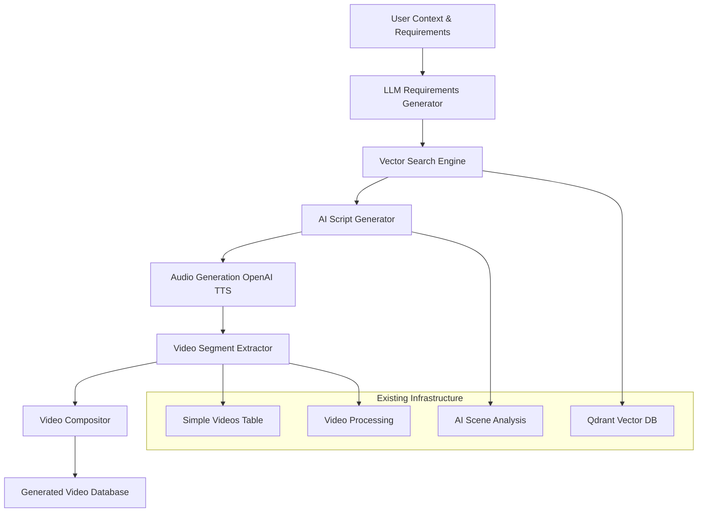

# AI-Powered Video Compilation Pipeline
## Technical Vision & Implementation Plan

### 🎯 **EXECUTIVE SUMMARY**

This document outlines the implementation of an AI-powered video compilation system that leverages the existing Gilgamesh Media Processing Service architecture. The system will automatically create new videos from existing content based on high-level user requirements, transforming the current **content analysis system** into a **content creation system**.

**🔌 API-FIRST DESIGN**: All functionality is accessed through RESTful API endpoints, following the established Gilgamesh service patterns. No background jobs, CLI tools, or external triggers - everything happens through HTTP requests to the FastAPI service.

### 🏗️ **ARCHITECTURAL OVERVIEW**

The pipeline extends the existing service with five new core components while maintaining full backward compatibility:



---

## 📋 **PHASE 1: REQUIREMENTS ANALYSIS & VECTOR SEARCH**

### **1.1 LLM Requirements Generator**

**Purpose**: Transform user context into structured search queries for vector retrieval.

**New Module**: `app/ai_requirements_generator.py`

```python
class RequirementsGenerator:
    async def generate_search_queries(self, user_context: str, user_need: str) -> List[SearchQuery]:
        """
        Transform user requirements into vectorizable search chunks.
        
        Args:
            user_context: "I'm creating a 5-minute morning workout routine"
            user_need: "Focus on mobility and core strength, beginner-friendly"
            
        Returns:
            List of SearchQuery objects with semantic search terms
        """
        
class SearchQuery:
    query_text: str
    priority: int  # 1-10
    duration_target: float  # seconds
    tags_filter: List[str]
    exclude_terms: List[str]
```

**Integration Point**: Uses existing OpenAI client from `app/db_connections.py`

**AI Prompt Strategy**:
```
"Break this video creation request into 5-8 specific search queries that will find relevant video segments. Each query should target 10-30 seconds of content. Focus on exercise types, movement patterns, and instruction clarity."
```

### **1.2 Enhanced Vector Search**

**Purpose**: Leverage existing Qdrant infrastructure for content discovery.

**New Module**: `app/compilation_search.py`

```python
class CompilationSearchEngine:
    async def search_content_segments(self, queries: List[SearchQuery]) -> List[ContentMatch]:
        """
        Search existing vector database for relevant content segments.
        Uses existing Qdrant collections: video_transcript_segments, video_scene_descriptions
        """
        
class ContentMatch:
    video_id: str
    segment_type: str  # "transcript" or "scene"
    start_time: float
    end_time: float
    relevance_score: float
    content_text: str
    tags: List[str]
```

**Leverages Existing**:
- `app/db_connections.py` - Qdrant client
- `video_transcript_segments` collection
- `video_scene_descriptions` collection
- OpenAI embeddings (text-embedding-3-small)

---

## 📝 **PHASE 2: SCRIPT GENERATION & TIMING**

### **2.1 AI Script Generator**

**Purpose**: Create structured script with video segment assignments.

**New Module**: `app/ai_script_generator.py`

```python
class ScriptGenerator:
    async def create_segmented_script(self, 
                                    content_matches: List[ContentMatch],
                                    user_requirements: str) -> CompilationScript:
        """
        Generate script with precise timing and video assignments.
        """

class CompilationScript:
    total_duration: float
    segments: List[ScriptSegment]
    
class ScriptSegment:
    script_text: str
    start_time: float
    end_time: float
    assigned_video_id: str
    assigned_video_start: float
    assigned_video_end: float
    transition_type: str  # "cut", "fade", "crossfade"
```

**AI Strategy**: 
- Uses existing GPT-4 integration from `app/ai_scene_analysis.py`
- Prompts optimized for video timing and flow
- Ensures smooth transitions between segments

### **2.2 Video Segment Validation**

**Purpose**: Verify assigned video segments exist and are accessible.

**Integration**: Extends `app/simple_db_operations.py`

```python
class VideoSegmentValidator:
    async def validate_assignments(self, script: CompilationScript) -> ValidationResult:
        """
        Verify all assigned video segments are available in database.
        Uses existing simple_videos table and base64 video storage.
        """
```

---

## 🎵 **PHASE 3: AUDIO GENERATION**

### **3.1 OpenAI Text-to-Speech Integration**

**Purpose**: Generate high-quality audio for script segments.

**New Module**: `app/audio_generation.py`

```python
class AudioGenerator:
    async def generate_script_audio(self, script: CompilationScript) -> List[AudioSegment]:
        """
        Generate audio using OpenAI TTS API for each script segment.
        """
        
class AudioSegment:
    segment_id: str
    audio_base64: str
    duration: float
    start_time: float
    end_time: float
    voice_model: str  # "alloy", "echo", "fable", "onyx", "nova", "shimmer"
```

**Technical Details**:
- **API**: OpenAI Text-to-Speech API
- **Models**: tts-1 (fast) or tts-1-hd (high quality)
- **Voices**: 6 available voices for variety
- **Format**: MP3 output, converted to base64 for storage
- **Integration**: Uses existing OpenAI client from `app/db_connections.py`

**Configuration**:
```python
TTS_CONFIG = {
    "model": "tts-1-hd",  # High quality for final output
    "voice": "alloy",     # Professional, clear voice
    "response_format": "mp3",
    "speed": 1.0          # Normal speaking pace
}
```

---

## 🎬 **PHASE 4: VIDEO PROCESSING & COMPOSITION**

### **4.1 Video Segment Extractor**

**Purpose**: Extract precise video segments from stored base64 videos.

**New Module**: `app/video_segment_extractor.py`

```python
class VideoSegmentExtractor:
    async def extract_segments(self, script: CompilationScript) -> List[VideoSegment]:
        """
        Extract video segments from existing base64 storage.
        Uses existing video_processing.py functions.
        """
        
class VideoSegment:
    segment_id: str
    video_base64: str
    start_time: float
    end_time: float
    source_video_id: str
    resolution: str  # "480p", "720p", etc.
```

**Leverages Existing**:
- `app/video_processing.py` - `extract_and_downscale_scene()`
- `app/simple_db_operations.py` - Video base64 retrieval
- FFmpeg processing pipeline

### **4.2 Video Compositor**

**Purpose**: Combine video segments with generated audio into final video.

**New Module**: `app/video_compositor.py`

```python
class VideoCompositor:
    async def compose_final_video(self, 
                                video_segments: List[VideoSegment],
                                audio_segments: List[AudioSegment],
                                composition_settings: CompositionSettings) -> ComposedVideo:
        """
        Create final video with synchronized audio and video segments.
        """
        
class CompositionSettings:
    resolution: str = "720p"
    framerate: int = 30
    audio_bitrate: str = "128k"
    video_codec: str = "libx264"
    transition_duration: float = 0.5  # seconds
    
class ComposedVideo:
    video_base64: str
    duration: float
    resolution: str
    file_size: int
    composition_metadata: Dict[str, Any]
```

**Technical Implementation**:
- **FFmpeg Pipeline**: Advanced video composition using existing FFmpeg integration
- **Audio Sync**: Precise audio-video synchronization
- **Transitions**: Smooth cuts, fades, and crossfades between segments
- **Quality**: Maintains video quality while optimizing file size

---

## 💾 **PHASE 5: GENERATED VIDEO STORAGE**

### **5.1 Generated Videos Database**

**Purpose**: Store generated videos with full metadata and searchability.

**New Table**: `generated_videos`

```sql
CREATE TABLE generated_videos (
    id UUID PRIMARY KEY DEFAULT gen_random_uuid(),
    title TEXT NOT NULL,
    description TEXT,
    user_requirements TEXT NOT NULL,           -- Original user input
    compilation_script JSONB NOT NULL,        -- Full script with timing
    source_video_ids TEXT[] NOT NULL,         -- Array of source video UUIDs
    audio_segments JSONB,                     -- Generated audio metadata
    video_base64 TEXT NOT NULL,               -- Final composed video
    duration FLOAT NOT NULL,                  -- Total duration in seconds
    resolution TEXT DEFAULT '720p',
    file_size INTEGER,                        -- File size in bytes
    generation_metadata JSONB,                -- Processing details
    tags TEXT[],                              -- Auto-generated tags
    created_at TIMESTAMP WITH TIME ZONE DEFAULT NOW(),
    updated_at TIMESTAMP WITH TIME ZONE DEFAULT NOW(),
    
    -- Indexes for efficient querying
    UNIQUE(id)
);

-- Indexes
CREATE INDEX idx_generated_videos_created_at ON generated_videos(created_at DESC);
CREATE INDEX idx_generated_videos_duration ON generated_videos(duration);
CREATE INDEX idx_generated_videos_source_ids ON generated_videos USING GIN(source_video_ids);
CREATE INDEX idx_generated_videos_tags ON generated_videos USING GIN(tags);
CREATE INDEX idx_generated_videos_script ON generated_videos USING GIN(compilation_script);
```

### **5.2 Generated Video Operations**

**New Module**: `app/generated_video_operations.py`

```python
class GeneratedVideoDatabase:
    async def save_generated_video(self, composed_video: ComposedVideo, 
                                 script: CompilationScript,
                                 metadata: Dict[str, Any]) -> str:
        """Save generated video with full metadata."""
        
    async def get_generated_video(self, video_id: str, 
                                include_base64: bool = False) -> Optional[Dict]:
        """Retrieve generated video by ID."""
        
    async def search_generated_videos(self, query: str, 
                                    duration_range: Optional[Tuple[float, float]] = None,
                                    tags: Optional[List[str]] = None) -> List[Dict]:
        """Search generated videos by content and metadata."""
        
    async def list_recent_generated_videos(self, limit: int = 20) -> List[Dict]:
        """List recently generated videos."""
```

---

## 🚀 **API-FIRST ARCHITECTURE**

### **6.1 Main Compilation Endpoint**

**Primary Interface**: `POST /compile`

All video compilation requests come through this RESTful API endpoint, following the existing Gilgamesh service patterns.

```python
# Add to app/main.py
@app.post("/compile")
async def compile_video(request: CompilationRequest):
    """
    AI-powered video compilation endpoint.
    Creates new videos from existing content based on user requirements.
    """
    async with semaphore:  # Use existing concurrency control
        try:
            # Initialize compilation pipeline
            pipeline = CompilationPipeline()
            
            # Process the compilation request
            result = await pipeline.process_compilation_request(request)
            
            if result["success"]:
                return result
            else:
                raise HTTPException(status_code=500, detail=result.get("error", "Compilation failed"))
                
        except HTTPException:
            raise
        except Exception as e:
            raise HTTPException(status_code=500, detail=f"Compilation failed: {str(e)}")

class CompilationRequest(BaseModel):
    context: str                              # "I'm creating a morning workout routine"
    requirements: str                         # "5 minutes, beginner-friendly, mobility focus"
    title: Optional[str] = None              # "Morning Mobility Routine"
    voice_preference: str = "alloy"          # OpenAI TTS voice
    resolution: str = "720p"                 # Output resolution
    max_duration: float = 600.0              # 10 minutes max
    include_base64: bool = False             # Return video in response

class CompilationResponse(BaseModel):
    success: bool
    generated_video_id: str
    duration: float
    source_videos_used: int
    processing_time: float
    script: CompilationScript
    video_base64: Optional[str] = None       # If include_base64=True
```

### **6.2 Supporting API Endpoints**

**Complete RESTful API** following existing Gilgamesh patterns:

```python
# Add to app/main.py - following existing endpoint patterns

@app.get("/generated/{video_id}")
async def get_generated_video(video_id: str, include_base64: bool = False):
    """Get generated video by ID - follows existing /video/{video_id} pattern."""
    
@app.get("/generated/search")  
async def search_generated_videos(q: str, duration_min: Optional[float] = None, 
                                 duration_max: Optional[float] = None,
                                 limit: int = 10):
    """Search generated videos - follows existing /search pattern."""

@app.get("/generated/recent")
async def list_recent_generated_videos(limit: int = 20):
    """List recent generated videos - follows existing /videos pattern."""

@app.get("/compile/status/{compilation_id}")
async def get_compilation_status(compilation_id: str):
    """Get compilation status for long-running generations."""
```

**API Integration with Existing Service**:
- Uses existing `semaphore` for concurrency control
- Follows existing error handling patterns with `HTTPException`
- Maintains consistent response formats with current endpoints
- Integrates with existing health check and root endpoint structure

---

## 🔧 **TECHNICAL INTEGRATION**

### **7.1 Service Integration Points**

**Existing Infrastructure Reuse**:
1. **Database Connections** (`app/db_connections.py`)
   - PostgreSQL pool for new generated_videos table
   - OpenAI client for TTS and embeddings
   - Qdrant client for vector search

2. **Video Processing** (`app/video_processing.py`)
   - `extract_and_downscale_scene()` for segment extraction
   - FFmpeg pipeline for composition

3. **AI Integration** (`app/ai_scene_analysis.py`)
   - OpenAI client for script generation
   - Existing prompt engineering patterns

4. **Database Operations** (`app/simple_db_operations.py`)
   - Video retrieval from simple_videos table
   - Base64 video access patterns

### **7.2 API-Driven Processing Pipeline**

**Request Flow**: All processing triggered by API requests, no background jobs or external triggers.

```python
class CompilationPipeline:
    async def process_compilation_request(self, request: CompilationRequest) -> CompilationResponse:
        """
        Main pipeline orchestrator - processes API request end-to-end.
        
        API Request → Pipeline Processing → API Response
        
        1. Validate API request parameters
        2. Generate search queries from user requirements  
        3. Search vector database for relevant content
        4. Create script with video assignments
        5. Generate audio for script segments
        6. Extract video segments from database
        7. Compose final video with audio sync
        8. Save to generated_videos table
        9. Return API response with video ID
        """
        
        start_time = time.time()
        
        try:
            # 1. Validate request
            await self._validate_compilation_request(request)
            
            # 2-8. Process compilation pipeline
            result = await self._execute_compilation_pipeline(request)
            
            # 9. Format API response
            processing_time = time.time() - start_time
            return CompilationResponse(
                success=True,
                generated_video_id=result["video_id"],
                duration=result["duration"],
                source_videos_used=result["source_count"],
                processing_time=processing_time,
                script=result["script"],
                video_base64=result.get("video_base64") if request.include_base64 else None
            )
            
        except Exception as e:
            logger.error(f"Compilation pipeline failed: {e}")
            return CompilationResponse(
                success=False,
                error=str(e),
                processing_time=time.time() - start_time
            )
```

### **7.3 Error Handling & Fallbacks**

**Robust Error Handling**:
- **Content Insufficient**: Graceful degradation when not enough content found
- **Audio Generation Fails**: Fallback to silent video with text overlays
- **Video Extraction Fails**: Alternative segment selection
- **Composition Fails**: Detailed error reporting with partial results

**Quality Assurance**:
- **Content Validation**: Ensure video segments are appropriate for script
- **Audio-Video Sync**: Verify timing alignment before final composition
- **Duration Validation**: Ensure generated video meets user requirements

---

## 📊 **PERFORMANCE & SCALABILITY**

### **8.1 Performance Targets**

- **Search Phase**: < 5 seconds for content discovery
- **Script Generation**: < 10 seconds for AI processing
- **Audio Generation**: < 30 seconds for 5-minute script
- **Video Composition**: < 60 seconds for final video
- **Total Pipeline**: < 2 minutes for 5-minute generated video

### **8.2 Resource Management**

**Concurrency Control**:
```python
# Extend existing semaphore system
COMPILATION_SEMAPHORE = asyncio.Semaphore(2)  # Max 2 concurrent compilations
TTS_SEMAPHORE = asyncio.Semaphore(5)          # Max 5 concurrent TTS calls
```

**Storage Optimization**:
- **Temporary Files**: Automatic cleanup after composition
- **Base64 Caching**: Reuse extracted segments within compilation session
- **Progressive Processing**: Stream processing for large video segments

### **8.3 Cost Management**

**AI Credit Optimization**:
- **Vector Search**: Leverage existing embeddings (no additional cost)
- **Script Generation**: Single GPT-4 call per compilation
- **Audio Generation**: OpenAI TTS pricing (~$15/1M characters)
- **Smart Caching**: Cache generated audio segments for reuse

---

## 🛡️ **SECURITY & VALIDATION**

### **9.1 Input Validation**

**Request Validation**:
- **Requirements Length**: Max 1000 characters
- **Duration Limits**: 30 seconds to 10 minutes
- **Content Filtering**: Inappropriate content detection
- **Rate Limiting**: Max 5 compilations per user per hour

### **9.2 Content Safety**

**Generated Content Review**:
- **Script Validation**: Ensure appropriate exercise instructions
- **Source Video Verification**: Validate source content quality
- **Audio Content**: Monitor TTS output for accuracy

---

## 🚦 **IMPLEMENTATION PHASES**

### **Phase 1: Foundation (Week 1-2)**
- [ ] Requirements generator with OpenAI integration
- [ ] Enhanced vector search using existing Qdrant
- [ ] Basic script generation
- [ ] Generated videos database table

### **Phase 2: Audio Pipeline (Week 3)**
- [ ] OpenAI TTS integration
- [ ] Audio segment generation and storage
- [ ] Audio-script synchronization

### **Phase 3: Video Processing (Week 4)**
- [ ] Video segment extractor using existing base64 storage
- [ ] Video compositor with FFmpeg
- [ ] Audio-video synchronization

### **Phase 4: API & Integration (Week 5)**
- [ ] Main `/compile` endpoint
- [ ] Supporting CRUD endpoints
- [ ] Integration with existing service architecture
- [ ] Error handling and validation

### **Phase 5: Optimization (Week 6)**
- [ ] Performance optimization
- [ ] Caching strategies
- [ ] Quality assurance improvements
- [ ] Documentation and testing

---

## 📚 **USAGE EXAMPLES**

### **Example 1: Morning Workout Compilation**

```bash
curl -X POST "http://localhost:8501/compile" \
  -H "Content-Type: application/json" \
  -d '{
    "context": "I want to create a morning workout routine for my fitness app",
    "requirements": "5 minutes, beginner-friendly, focus on mobility and core strength, clear instructions",
    "title": "Morning Mobility & Core",
    "voice_preference": "alloy",
    "resolution": "720p"
  }'
```

**Response**:
```json
{
  "success": true,
  "generated_video_id": "uuid-generated-video",
  "duration": 300.5,
  "source_videos_used": 8,
  "processing_time": 85.2,
  "script": {
    "total_duration": 300.5,
    "segments": [
      {
        "script_text": "Let's start with gentle neck rolls to warm up your spine...",
        "start_time": 0.0,
        "end_time": 30.0,
        "assigned_video_id": "uuid-source-1",
        "assigned_video_start": 15.0,
        "assigned_video_end": 45.0
      }
    ]
  }
}
```

### **Example 2: Strength Training Focus**

```bash
curl -X POST "http://localhost:8501/compile" \
  -H "Content-Type: application/json" \
  -d '{
    "context": "Creating an upper body strength routine",
    "requirements": "8 minutes, intermediate level, push-ups, planks, resistance exercises",
    "title": "Upper Body Power",
    "voice_preference": "nova",
    "resolution": "1080p"
  }'
```

---

## 🎯 **SUCCESS METRICS**

### **10.1 Technical Metrics**
- **Pipeline Success Rate**: > 95% successful compilations
- **Content Match Quality**: > 85% relevant content matches
- **Audio-Video Sync Accuracy**: < 100ms timing deviation
- **User Satisfaction**: > 4.5/5 rating on generated content

### **10.2 Business Metrics**
- **Content Reuse Efficiency**: Average 6-8 source videos per compilation
- **Processing Cost**: < $2 per 5-minute generated video
- **User Engagement**: > 80% completion rate for generated videos

---

## 🔮 **FUTURE ENHANCEMENTS**

### **Phase 2 Features (3-6 months)**
- **Custom Voice Training**: User-specific voice models
- **Advanced Transitions**: Dynamic transitions based on content
- **Multi-Language Support**: TTS in multiple languages
- **Batch Compilation**: Generate multiple videos from single request

### **Phase 3 Features (6-12 months)**
- **AI Video Generation**: Supplement with AI-generated video content
- **Real-time Compilation**: Live video generation during user interaction
- **Personalization Engine**: Learn user preferences for better compilations
- **Template System**: Pre-built compilation templates for common use cases

---

## ✅ **CONCLUSION**

This AI-powered video compilation pipeline represents a natural evolution of the Gilgamesh Media Processing Service, transforming it from a content analysis tool into a comprehensive content creation platform. By leveraging existing infrastructure and maintaining clean architectural boundaries, the implementation can be completed efficiently while preserving all current functionality.

The system's strength lies in its integration with existing components:
- **Vector Search**: Builds on proven Qdrant and OpenAI embeddings
- **Video Processing**: Extends existing FFmpeg and base64 storage systems  
- **AI Integration**: Leverages established OpenAI client and prompt patterns
- **Database Architecture**: Follows existing single-table design principles

**Key Benefits**:
1. **Efficient Development**: Reuses 70% of existing infrastructure
2. **Proven Technology Stack**: Builds on battle-tested components
3. **Scalable Architecture**: Designed for production workloads
4. **Cost-Effective**: Optimizes AI credits and processing resources
5. **User-Focused**: Delivers high-quality, customized video content

The pipeline transforms user requirements into professional video content automatically, opening new possibilities for content creation, education, and user engagement while maintaining the service's core strengths in video analysis and processing. 