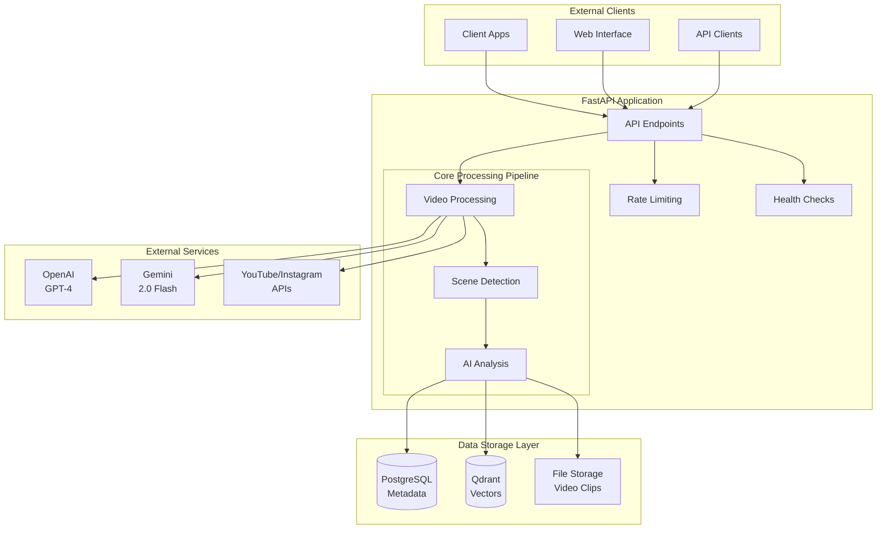
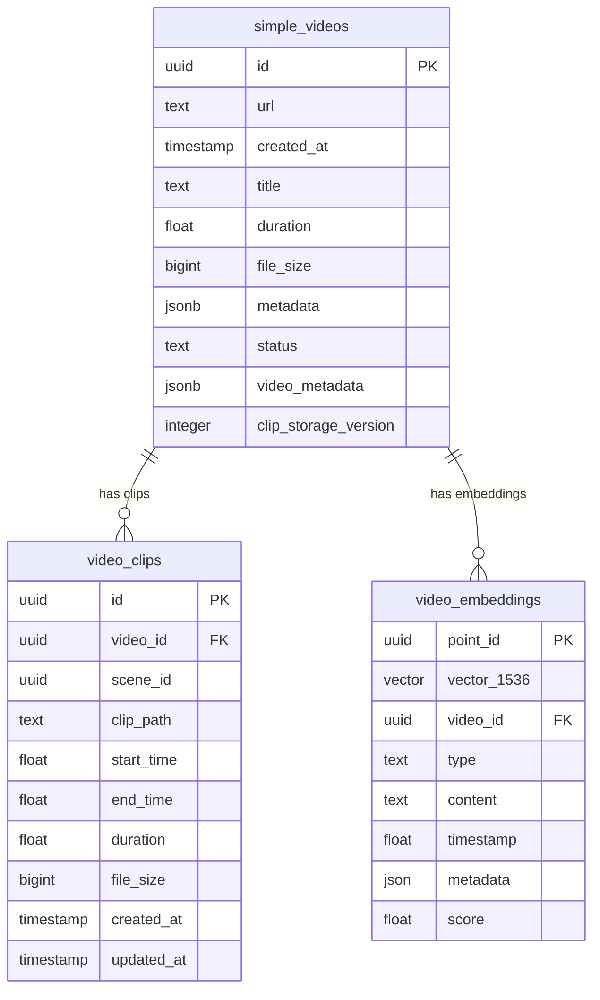
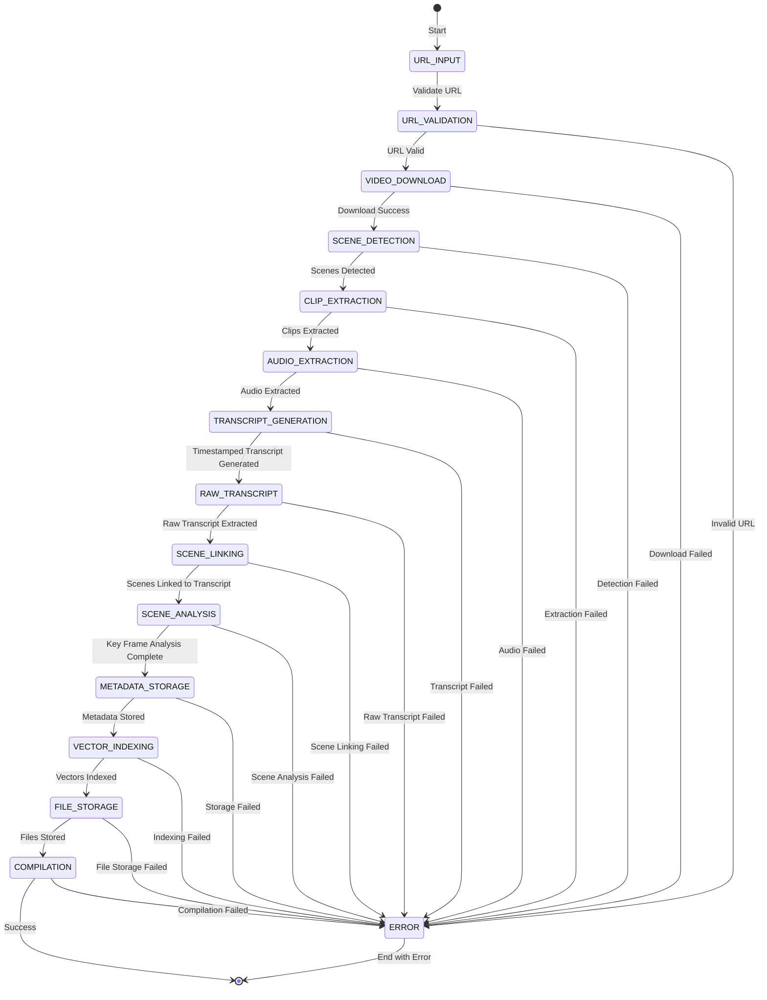
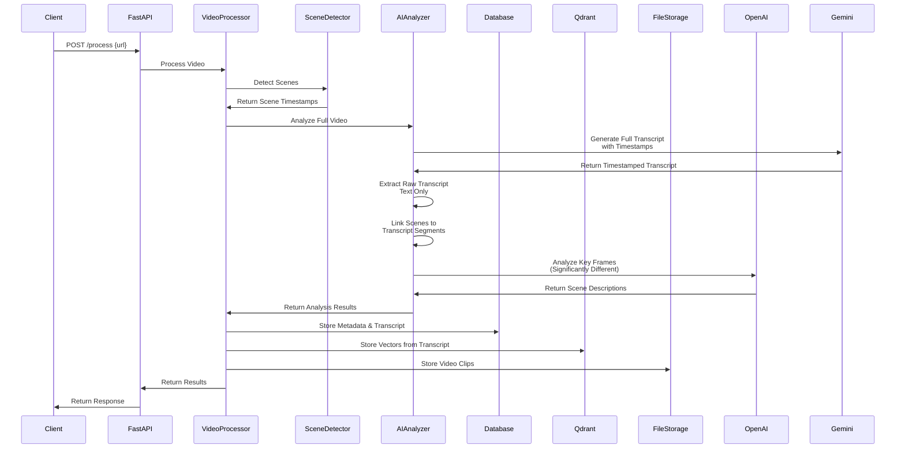
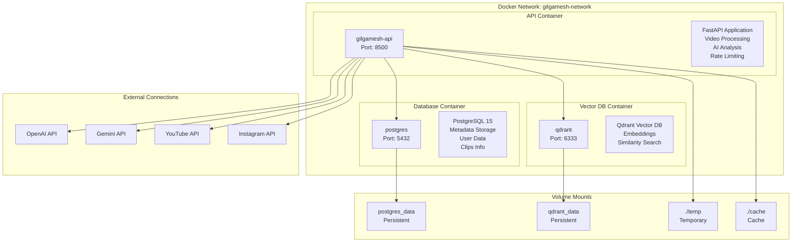
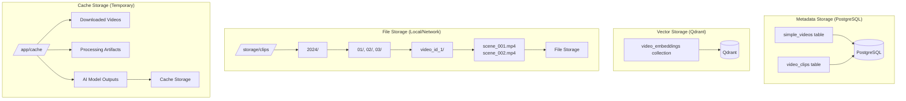
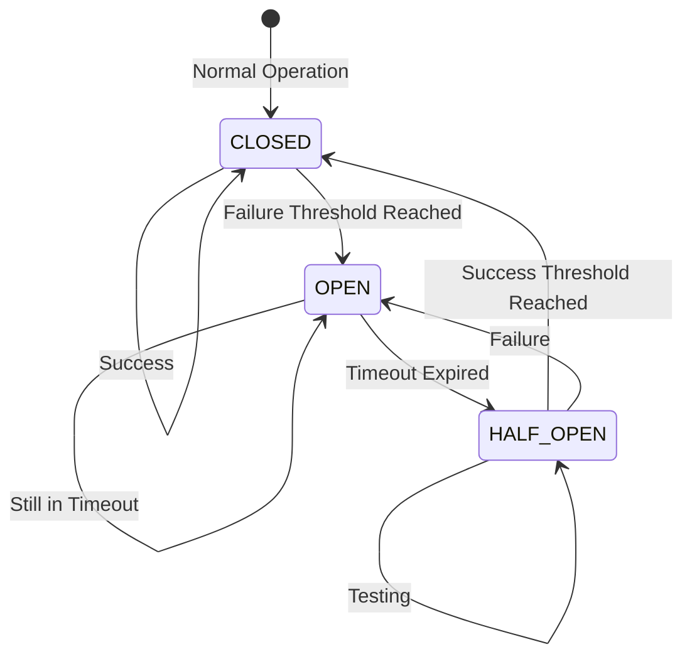
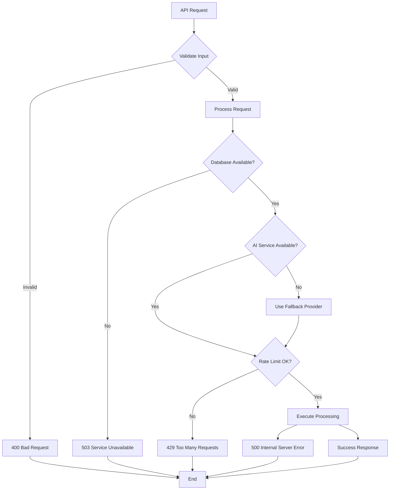
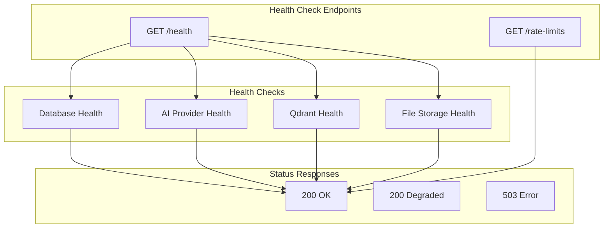

# Gilgamesh Service Architecture - Mermaid Diagrams

## Overview
This document contains comprehensive Mermaid diagrams that serve as the programmatic "guiding star" for all documentation. These diagrams ensure consistency across data storage, API endpoints, and system components.

## 1. System Architecture Overview



## 2. Data Flow Architecture

```mermaid
flowchart TD
    subgraph "1. Input Processing"
        URL[URL Input]
        VAL[Validation]
        DL[Download Service]
        
        URL --> VAL
        VAL --> DL
    end

    subgraph "2. Video Processing"
        VD[Video Download]
        SD[Scene Detection]
        CE[Clip Extraction]
        
        DL --> VD
        VD --> SD
        SD --> CE
    end

    subgraph "3. AI Analysis"
        AE[Audio Extraction<br/>from Full Video]
        TG[Full Transcript<br/>with Timestamps]
        RT[Raw Transcript<br/>Text Only]
        LS[Link Scenes to<br/>Transcript Segments]
        SA[Scene Analysis using<br/>H.264 Key Frames<br/>(Significantly Different)]
        
        VD --> AE
        AE --> TG
        TG --> RT
        TG --> LS
        LS --> SA
    end

    subgraph "4. Storage & Indexing"
        MS[Metadata Storage]
        VI[Vector Indexing]
        FST[File Storage]
        
        SA --> MS
        TG --> MS
        RT --> MS
        TG --> VI
        CE --> FST
    end

    subgraph "5. Compilation"
        SM[Search & Match]
        SV[Stitch Videos]
        OG[Output Generation]
        
        VI --> SM
        SM --> SV
        SV --> OG
    end
```

## 3. Database Schema Architecture



## 4. API Endpoints Architecture

```mermaid
graph TB
    subgraph "Core Processing Endpoints"
        PROCESS[POST /process]
        PROCESS_PARAMS[url, save_video, transcribe, describe,<br/>save_to_postgres, save_to_qdrant,<br/>include_base64, raw_transcript]
    end

    subgraph "Vectorization Endpoints"
        VECTORIZE[POST /vectorize/existing]
        VECTORIZE_PARAMS[limit, dry_run, verbose]
        
        QDRANT_INDEX[POST /qdrant/force-index]
        QDRANT_PARAMS[collections, force_rebuild]
    end

    subgraph "Retrieval Endpoints"
        GET_VIDEO[GET /video/{video_id}]
        GET_VIDEO_PARAMS[video_id, include_base64]
        
        GET_CAROUSEL[GET /carousel]
        GET_CAROUSEL_PARAMS[url, include_base64]
        
        SEARCH[GET /search]
        SEARCH_PARAMS[q, limit]
        
        LIST_VIDEOS[GET /videos]
        LIST_VIDEOS_PARAMS[limit]
    end

    subgraph "System Endpoints"
        ROOT[GET /]
        HEALTH[GET /health]
        RATE_LIMITS[GET /rate-limits]
    end

    PROCESS --> PROCESS_PARAMS
    VECTORIZE --> VECTORIZE_PARAMS
    QDRANT_INDEX --> QDRANT_PARAMS
    GET_VIDEO --> GET_VIDEO_PARAMS
    GET_CAROUSEL --> GET_CAROUSEL_PARAMS
    SEARCH --> SEARCH_PARAMS
    LIST_VIDEOS --> LIST_VIDEOS_PARAMS
```

## 5. Processing Pipeline Architecture



## 6. Component Interaction Architecture



## 7. Deployment Architecture



## 8. Data Storage Strategy



## 9. Rate Limiting & Circuit Breaker Architecture



## 10. Error Handling Flow



## 11. Health Check Architecture



## Usage Guidelines

### For Documentation Consistency
1. **Reference these Mermaid diagrams** in all documentation files
2. **Maintain consistency** with the data flow and component interactions shown
3. **Update diagrams** when architecture changes are made
4. **Use consistent terminology** across all documentation

### For Development
1. **Follow the data flow** shown in the processing pipeline
2. **Respect the API contract** defined in the endpoints architecture
3. **Maintain the database schema** structure shown
4. **Adhere to the deployment** patterns illustrated

### For Testing
1. **Test each component** according to the interaction architecture
2. **Validate data flow** through the processing pipeline
3. **Verify API endpoints** match the defined contract
4. **Check storage consistency** across all data stores

## Notes
- **Scalability**: Architecture supports horizontal scaling of API containers
- **Reliability**: Circuit breaker and rate limiting ensure system stability
- **Maintainability**: Clear separation of concerns between components
- **Extensibility**: Modular design allows for easy addition of new features
- **Monitoring**: Built-in health checks and metrics for all components 